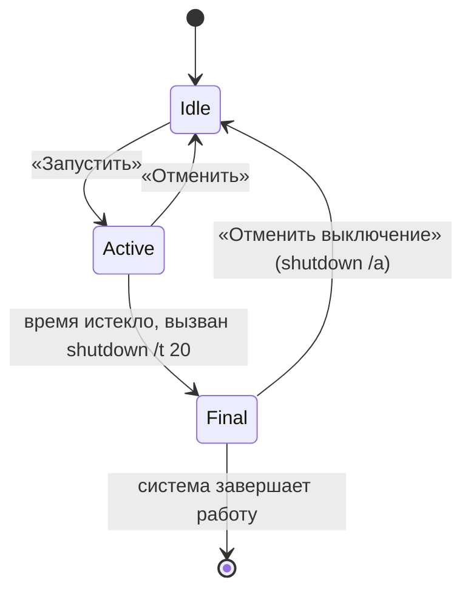

# Архитектура

Документ описывает, как устроено приложение сейчас. Он пригодится тем, кто хочет доработать код.

## Стек

- C# 12, .NET 8 (`net8.0-windows`)
- WPF для интерфейса
- Windows Forms подключены только ради `NotifyIcon` (значок в трее)
- системная утилита `shutdown.exe` для самого выключения

## Файлы

| Файл | Назначение |
|---|---|
| `src/ShutdownTimer/App.xaml` | Описание приложения (стартовое окно не задаётся) |
| `src/ShutdownTimer/App.xaml.cs` | Запуск: проверка единственного экземпляра, создание главного окна |
| `src/ShutdownTimer/MainWindow.xaml` | Палитра, разметка окна, стили кнопок, переключателей и тумблера, анимации на триггерах |
| `src/ShutdownTimer/MainWindow.xaml.cs` | Интерфейс: состояния, трей, настройки, локализация, показ напоминаний, отрисовка и анимация кольца |
| `src/ShutdownTimer/SettingsWindow.xaml(.cs)` | Окно пользовательских настроек: язык и автозапуск |
| `src/ShutdownTimer/Localization.cs` | Русский/English и автоматическое определение UI-языка Windows |
| `src/ShutdownTimer/StartupManager.cs` | Управление автозапуском через HKCU Run |
| `Stepper` (в конце `MainWindow.xaml.cs`) | Числовой выбор с кнопками ▲ ▼ и колесом мыши, создаётся из кода |
| `src/ShutdownTimer.Core/TimeLogic.cs` | Вся арифметика времени: без WPF и без обращения к системным часам |
| `src/ShutdownTimer.Core/AppSettings.cs` | Класс `AppSettings`: чтение и запись настроек в JSON |
| `tests/ShutdownTimer.Tests/` | Юнит-тесты `TimeLogic` и `AppSettings` (xUnit) |

## Настройки

Класс `AppSettings` (`ShutdownTimer.Core/AppSettings.cs`) хранит режим, время для таймера и для точного времени, действие, состояние напоминаний, язык (`auto`/`ru`/`en`) и настройку автозапуска. Файл лежит в `%AppData%\ShutdownTimer\settings.json`, формат — JSON (`System.Text.Json`).

- **Загрузка.** `AppSettings.Load()` вызывается при создании `MainWindow`. Если файла нет или он не читается, возвращаются значения по умолчанию. Значения вне допустимых диапазонов приводятся к ним в `Normalize()`.
- **Применение.** В конструкторе окна значения подставляются в `Stepper`, переключатели режима и действия и тумблер напоминаний. Если время для режима «Точное время» ещё не выбиралось, берётся «текущее время плюс час».
- **Сохранение.** Любое изменение вызывает `ScheduleSave()`, который перезапускает таймер на 400 мс: файл записывается один раз после паузы. Дополнительно настройки сохраняются при запуске таймера, при выходе через трей и при завершении сеанса Windows (`SessionEnding`).
- **Надёжность.** Запись идёт через временный файл `settings.json.tmp` с последующей заменой, ошибки доступа к диску не прерывают работу приложения.

При `Language = auto` язык определяется по `CultureInfo.CurrentUICulture`: для Windows с English UI выбирается English, для остальных систем — русский. Если пользователь выбрал `ru` или `en`, его выбор имеет приоритет.

Автозапуск регистрируется только для текущего пользователя через `HKCU\Software\Microsoft\Windows\CurrentVersion\Run`, поэтому права администратора не нужны.

Запущенный таймер в настройки не входит: после перезапуска приложение всегда стартует в состоянии ожидания.

## Слои

Проект разделён на две части, чтобы логику можно было проверять тестами без запуска окна:

- **`ShutdownTimer.Core`** (`net8.0`) не знает про WPF. `TimeLogic` — статический класс с чистыми функциями: «сейчас» всегда приходит параметром, поэтому результат зависит только от входных данных. `AppSettings` читает и пишет JSON.
- **`ShutdownTimer`** (`net8.0-windows`) ссылается на Core. `MainWindow` собирает значения из интерфейса, вызывает `TimeLogic` и показывает результат.
- **`ShutdownTimer.Tests`** (`net8.0`) ссылается только на Core.

Что где: `NextClockTime`, `TimerTarget`, `IsDelayValid`, `RemainingSeconds`, `FormatCountdown`, `FormatSpan`, `RemainingFraction`, `Wrap` и `TakeDueReminders` лежат в `TimeLogic`. `MainWindow` только подставляет в них `DateTime.Now` и значения счётчиков.

## Единственный экземпляр

В `App.OnStartup` создаётся именованный `Mutex` (`Local\ShutdownTimer.SingleInstance`):

- **Первый запуск** получает владение мьютексом, создаёт и показывает `MainWindow`, затем запускает фоновый поток. Поток ждёт именованное событие `Local\ShutdownTimer.ShowWindow` и при его срабатывании вызывает `MainWindow.ShowFromTray()` через `Dispatcher`.
- **Повторный запуск** мьютекс получить не может. Он взводит событие, чтобы первая копия показала окно, и сразу вызывает `Shutdown()`, не создавая окна и значка в трее.

Префикс `Local\` ограничивает проверку одним сеансом пользователя Windows. Мьютекс освобождается в `App.OnExit`.

## Состояния

В коде состояния задаются двумя флагами:

| `_active` | `_final` | Состояние |
|---|---|---|
| false | false | Ожидание, идёт выбор времени |
| true | false | Таймер запущен |
| true | true | Команда `shutdown` отправлена, идёт 20-секундный отсчёт |

## Главный цикл

`DispatcherTimer` срабатывает каждые 200 мс и вызывает `OnTick()`:

- **Ожидание.** Раз в секунду обновляются превью времени и подсказка («Сработает в 23:40»).
- **Таймер запущен.** Считается остаток `_target - DateTime.Now`, обновляются цифры и подсказка значка в трее. Проверяются пороги напоминаний. Когда остаток доходит до нуля, вызывается `Fire()`. Кольцо в тике не перерисовывается: им занимается отдельная анимация (см. ниже).
- **Финальный отсчёт.** Тот же расчёт на 20 секунд, без напоминаний.

Время цели вычисляется один раз при запуске (`_target`), а остаток берётся по системным часам, поэтому отсчёт не «уплывает» при задержках в цикле.

## Напоминания

Пороги лежат в `TimeLogic.ReminderMarks` (в секундах до конца): 600, 300, 60, 30. Для каждого запуска ведётся множество `_fired`, чтобы порог сработал один раз; решение принимает `TimeLogic.TakeDueReminders`. Порог пропускается, если он не меньше всей длительности таймера (например, при таймере на 8 минут напоминания за 10 минут не будет). Уведомление показывается через `NotifyIcon.ShowBalloonTip`, Windows 10/11 отображает его как обычный toast.

## Выключение

`Fire()` запускает `shutdown /s /t 20` или `/r /t 20`. Задержка нужна, чтобы пользователь мог отменить: `Cancel()` вызывает `shutdown /a`. Константа `FinalSeconds` задаёт длительность задержки.

## Трей

`NotifyIcon` создаётся в конструкторе окна. Значок рисуется программно в `MakeIcon()` (без файла ресурса). Закрытие окна перехватывается в `OnClosing`: окно скрывается, а не закрывается. Настоящий выход выполняет `ExitApp()`, который ставит флаг `_exit`, убирает значок и завершает `Application`.

## Кольцо обратного отсчёта

Кольцо состоит из фоновой окружности, широкой полупрозрачной дуги-«свечения» (`ArcGlow`) и основной `Path` (`Arc`) с градиентной обводкой.

Доля кольца хранится в свойстве зависимости `RingFraction`. При запуске таймера `StartRing` создаёт одну `DoubleAnimation` от текущей доли до нуля на всё оставшееся время, поэтому WPF сам обновляет дугу с частотой кадров (а не шагами по 200 мс). При каждом изменении значения вызывается `DrawArc`, который строит `ArcSegment` от верхней точки по часовой стрелке и замораживает геометрию (`Freeze`). Частота кадров анимации подбирается по скорости дуги: от 4 до 60 к/с. В начале дуга «вырастает» за 0,7 с (ease-out) и дальше убывает.

Если окно скрыто в трей или свёрнуто, анимации снимаются (`OnVisibilityChanged`), а при показе перезапускаются с актуального остатка. Номер поколения `_ringGen` защищает от устаревших обработчиков `Completed`.

## Анимации

| Что | Как реализовано |
|---|---|
| Появление окна | `DoubleAnimation` прозрачности и масштаба в `Loaded` |
| Наведение на кнопки | `Storyboard` в триггере `IsMouseOver` шаблона `Soft` |
| Переключатели режимов | `ColorAnimation` фона в триггере `IsChecked` шаблона `Seg` |
| Тумблер напоминаний | `ThicknessAnimation` бегунка и `ColorAnimation` дорожки в шаблоне `Toggle` |
| Смена панелей «Таймер» и «Точное время» | Прозрачность и сдвиг `TranslateTransform` в `Mode_Click` |
| Изменение цифры | «Подпрыгивание» масштаба в `Stepper.Set` |
| Ожидание | «Дыхание» прозрачности `TimeText` (`Breathe`, 30 к/с) |
| Кольцо | `DoubleAnimation` свойства `RingFraction` на всё время отсчёта (`StartRing`) |
| Напоминание | Пульс масштаба кольца (`Pulse`) |

## Цвета

Все цвета интерфейса заданы в начале `MainWindow.xaml` блоком `<Color x:Key="...">`, от них строятся кисти (`TextBrush`, `AccentBrush`, `CardBrush` и другие). Чтобы сменить гамму, достаточно изменить значения в этом блоке. C#-код берёт цвета из ресурсов через `FindResource`, значок в трее тоже.

| Ключ | Значение | Где используется |
|---|---|---|
| `BgTopColor`, `BgBottomColor` | `#212C2E`, `#1B2123` | градиент карточки |
| `AccentColor`, `Accent2Color` | `#759197`, `#7E9397` | дуга, кнопка «Запустить», выбранный пункт, тумблер |
| `OnAccentColor` | `#0B1B1E` | текст и значок на акцентном цвете |
| `SurfaceColor` | `#A60B1B1E` | подложка переключателей |
| `ChipColor`, `CardBorderColor`, `ToggleOffColor` | производные от акцента | кнопки-пресеты, окантовка, выключенный тумблер |
| `TextColor`, `TextSoftColor`, `TextSecondaryColor`, `TextMutedColor` | от светлого к приглушённому | текст разной важности |
| `StopStartColor`, `StopEndColor`, `OnStopColor` | красно-оранжевый градиент, тёмный текст | кнопка «Отменить» |
| `DangerColor` | `#E4887A` | сообщения об ошибке |

## Производительность

Окно с `AllowsTransparency` WPF рисует программно. Для чёткой рамки карточки `DropShadowEffect` вокруг окна не используется: внешняя граница сделана обычным 1px `Border`, поэтому края не получают размытого ореола на разных DPI. Что сделано:

- единственная тень под карточкой вынесена в отдельный слой с `CacheMode="BitmapCache"` и не пересчитывается при анимациях;
- свечение дуги и кнопки заменено обычными полупрозрачными фигурами без эффектов;
- кольцо анимируется одной анимацией, а не перерисовывается из таймера;
- анимации остановлены, когда окно не видно.

Замеров на реальных компьютерах пока нет: если анимации всё равно подтормаживают, стоит записать профиль (Visual Studio Performance Profiler) и проверить, не мешает ли `AllowsTransparency`.

## Что стоит улучшить

Расчёты времени и настройки уже вынесены в `ShutdownTimer.Core`, но состояние таймера и работа с треем всё ещё живут в `MainWindow`. При росте кода стоит разделить их:

1. Вынести состояние таймера (`_active`, `_final`, переходы между ними) в отдельный класс без WPF и покрыть тестами. Расчёты времени уже вынесены в `TimeLogic`.
2. Вынести работу с треем в `TrayService`.
3. Вынести вызов `shutdown` в интерфейс `IPowerAction`, чтобы добавить сон и гибернацию и заменять реализацию в тестах.
4. Перейти на MVVM, если интерфейс станет заметно сложнее.
