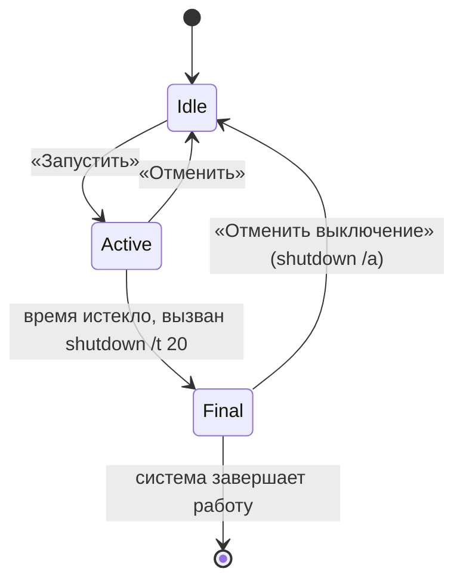

# Архитектура

Документ описывает, как устроено приложение сейчас. Он пригодится тем, кто хочет доработать код.

## Стек

- C# 12, .NET 8 (`net8.0-windows`)
- WPF для интерфейса
- Windows Forms подключены только ради `NotifyIcon` (значок в трее)
- системная утилита `shutdown.exe` для самого выключения

## Файлы

| Файл | Назначение |
|---|---|
| `App.xaml` | Описание приложения (стартовое окно не задаётся) |
| `App.xaml.cs` | Запуск: проверка единственного экземпляра, создание главного окна |
| `MainWindow.xaml` | Разметка окна, стили кнопок, переключателей и тумблера, анимации на триггерах |
| `MainWindow.xaml.cs` | Вся логика: таймер, состояния, трей, напоминания, отрисовка кольца |
| `Stepper` (в конце `MainWindow.xaml.cs`) | Числовой выбор с кнопками ▲ ▼ и колесом мыши, создаётся из кода |

## Единственный экземпляр

В `App.OnStartup` создаётся именованный `Mutex` (`Local\ShutdownTimer.SingleInstance`):

- **Первый запуск** получает владение мьютексом, создаёт и показывает `MainWindow`, затем запускает фоновый поток. Поток ждёт именованное событие `Local\ShutdownTimer.ShowWindow` и при его срабатывании вызывает `MainWindow.ShowFromTray()` через `Dispatcher`.
- **Повторный запуск** мьютекс получить не может. Он взводит событие, чтобы первая копия показала окно, и сразу вызывает `Shutdown()`, не создавая окна и значка в трее.

Префикс `Local\` ограничивает проверку одним сеансом пользователя Windows. Мьютекс освобождается в `App.OnExit`.

## Состояния

В коде состояния задаются двумя флагами:

| `_active` | `_final` | Состояние |
|---|---|---|
| false | false | Ожидание, идёт выбор времени |
| true | false | Таймер запущен |
| true | true | Команда `shutdown` отправлена, идёт 20-секундный отсчёт |

## Главный цикл

`DispatcherTimer` срабатывает каждые 200 мс и вызывает `OnTick()`:

- **Ожидание.** Раз в секунду обновляются превью времени и подсказка («Сработает в 23:40»).
- **Таймер запущен.** Считается остаток `_target - DateTime.Now`, обновляются цифры, кольцо и подсказка значка в трее. Проверяются пороги напоминаний. Когда остаток доходит до нуля, вызывается `Fire()`.
- **Финальный отсчёт.** Тот же расчёт на 20 секунд, без напоминаний.

Время цели вычисляется один раз при запуске (`_target`), а остаток берётся по системным часам, поэтому отсчёт не «уплывает» при задержках в цикле.

## Напоминания

Пороги лежат в `Marks` (в секундах до конца): 600, 300, 60, 30. Для каждого запуска ведётся множество `_fired`, чтобы порог сработал один раз. Порог пропускается, если он не меньше всей длительности таймера (например, при таймере на 8 минут напоминания за 10 минут не будет). Уведомление показывается через `NotifyIcon.ShowBalloonTip`, Windows 10/11 отображает его как обычный toast.

## Выключение

`Fire()` запускает `shutdown /s /t 20` или `/r /t 20`. Задержка нужна, чтобы пользователь мог отменить: `Cancel()` вызывает `shutdown /a`. Константа `FinalSeconds` задаёт длительность задержки.

## Трей

`NotifyIcon` создаётся в конструкторе окна. Значок рисуется программно в `MakeIcon()` (без файла ресурса). Закрытие окна перехватывается в `OnClosing`: окно скрывается, а не закрывается. Настоящий выход выполняет `ExitApp()`, который ставит флаг `_exit`, убирает значок и завершает `Application`.

## Кольцо обратного отсчёта

Кольцо состоит из фоновой окружности и `Path` с градиентной обводкой. `DrawArc(fraction)` строит дугу `ArcSegment` от верхней точки по часовой стрелке. Доля равна `остаток / общая длительность`, умноженной на коэффициент «въезда» (ease-out за 900 мс после запуска). Так дуга плавно рисуется в начале.

## Анимации

| Что | Как реализовано |
|---|---|
| Появление окна | `DoubleAnimation` прозрачности и масштаба в `Loaded` |
| Наведение на кнопки | `Storyboard` в триггере `IsMouseOver` шаблона `Soft` |
| Переключатели режимов | `ColorAnimation` фона в триггере `IsChecked` шаблона `Seg` |
| Тумблер напоминаний | `ThicknessAnimation` бегунка и `ColorAnimation` дорожки в шаблоне `Toggle` |
| Смена панелей «Таймер» и «Точное время» | Прозрачность и сдвиг `TranslateTransform` в `Mode_Click` |
| Изменение цифры | «Подпрыгивание» масштаба в `Stepper.Set` |
| Ожидание | «Дыхание» прозрачности `TimeText` (`Breathe`) |
| Напоминание | Пульс масштаба кольца (`Pulse`) |

## Что стоит улучшить

Сейчас логика и интерфейс находятся в одном классе. Это удобно для маленького приложения, но при росте кода стоит разделить его:

1. Вынести расчёт времени и состояния в отдельный класс (например, `ShutdownScheduler`) без зависимостей от WPF. Его можно покрыть юнит-тестами.
2. Вынести работу с треем в `TrayService`.
3. Вынести вызов `shutdown` в интерфейс `IPowerAction`, чтобы добавить сон и гибернацию и заменять реализацию в тестах.
4. Хранить настройки в JSON в `%AppData%\ShutdownTimer`.
5. Перейти на MVVM, если интерфейс станет заметно сложнее.
